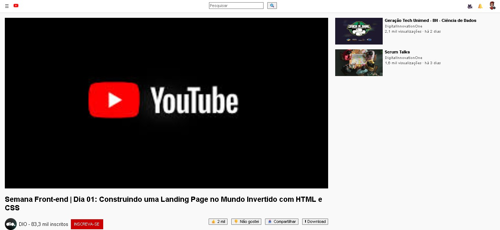

# 🎯 Desafio - Clone do YouTube (Layout Estático)

## 📌 Sobre o Projeto
Este projeto consiste na recriação da interface do **YouTube** utilizando apenas **HTML5 e CSS3**.  
O objetivo é praticar fundamentos de **estruturação semântica** e **estilização responsiva**, simulando a experiência de navegação da plataforma.

## 🖼️ Layout
O layout inclui:
- **Cabeçalho** com logo, barra de pesquisa e avatar.  
- **Área principal** com vídeo em destaque.  
- **Informações do vídeo** (título, canal e botões de interação).  
- **Sidebar** com vídeos recomendados.  

👉 Resultado esperado: uma réplica estática, visualmente próxima ao YouTube real.

## 🚀 Como Executar
1. Faça o download ou clone este repositório:
   ```bash
   git clone https://github.com/SEU-USUARIO/css-flexbox-youtube.git

Acesse a pasta do projeto.

Abra o arquivo index.html diretamente no navegador.

🛠️ Tecnologias Utilizadas

HTML5 para marcação semântica.

CSS3 para estilização e responsividade.

🎯 Objetivos de Aprendizado

Praticar boas práticas de HTML semântico.

Aprender a estruturar layouts mais complexos.

Reforçar habilidades em CSS Flexbox/Grid.

📸 Demonstração



👩‍💻 Autor

Projeto desenvolvido por [Rafael Pereira ].
[](www.linkedin.com/in/rpg2011/)

🔗 ![Linkedln] www.linkedin.com/in/rpg2011
